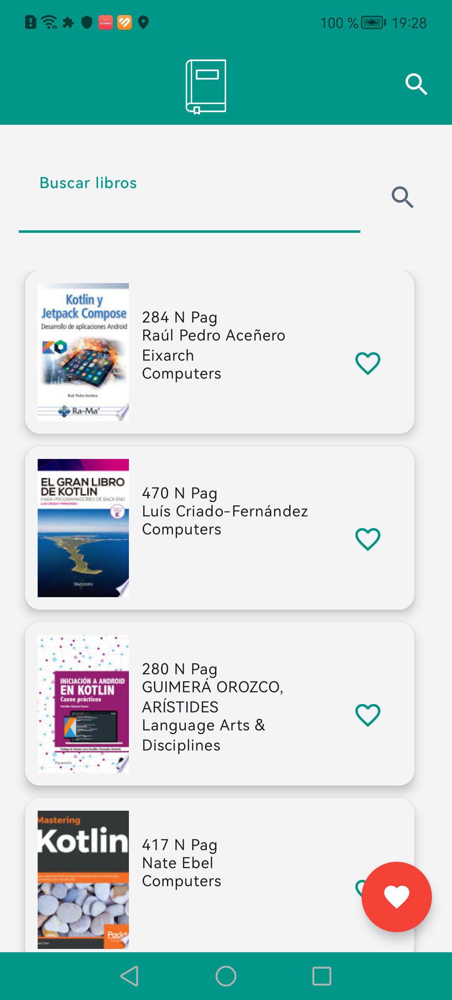
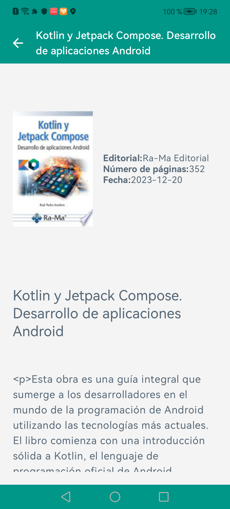
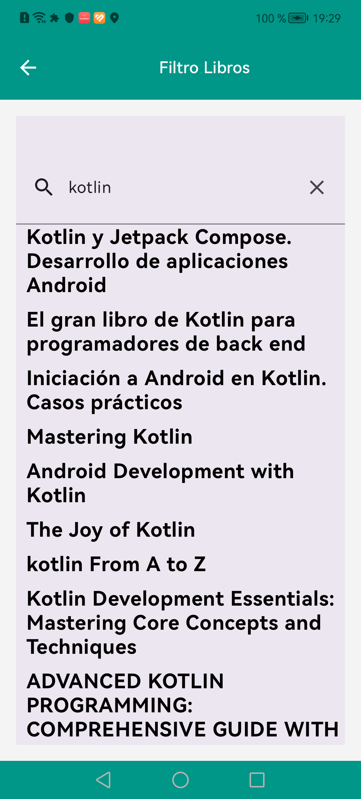
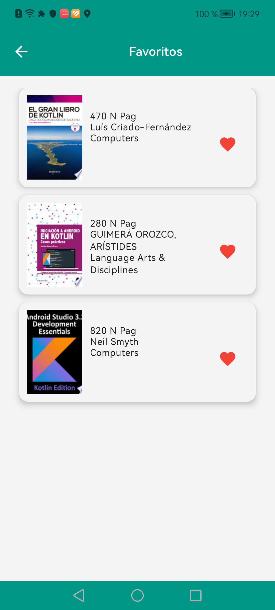

# Proyecto de una app libros favoritos

El proyecto es una app de libros favoritos y conecta a una API de Google Books y genera una lista de los libros en base a una búsqueda realizada. Permite guardar los libros favoritos en un almacenamiento local.

## Pantalla de bienvenida

## Pantalla de Inicio

## Pantalla de detalla libro

## Pantalla de filtro de libros

## Pantalla de favoritos de libros

## Características

- Pantalla de bienvenida
- Listado libros
- Filtro libros
- Guardar libros en la pantalla de favoritos
- listar libros en base una busqueda
- Detalle de un libro seleccionado.

## Pila de tecnología

Librerías utilizadas en el proyecto que se desarrolló en el lenguaje Kotlin y patrón de arquitectura de software de MVVM y Clean Architecture.

- ViewModel
- Gson 
- serialization-json
- Retrofit
- Coroutines
- Preferences DataStore
- Dagger hilt
- Paging 3
- jetpack compose
- Navigation
- Coil