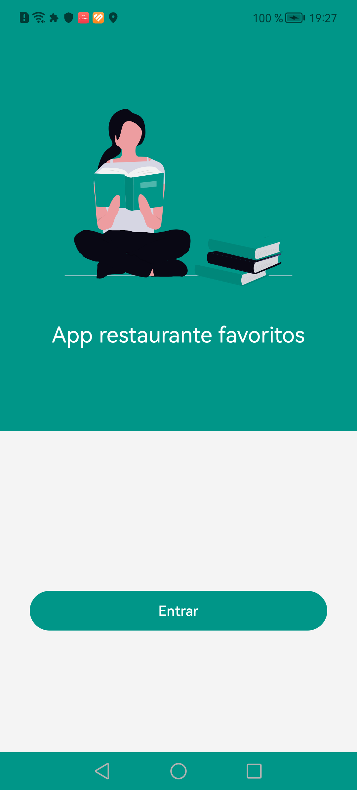

#  App libros favoritos
 
El proyecto es una app de libros favoritos que conecta a una API de Google Books y genera una lista de los libros en base a una búsqueda realizada. Permite guardar los libros favoritos en un almacenamiento local.
 

## Pantalla de bienvenida
 

 

## Pantalla de Inicio
 

 

## Pantalla de detalle libro
 

 

## Pantalla de filtro de libros
 

 

## Pantalla de favoritos de libros
 

 

## Características
 
- Pantalla de bienvenida
- Listado libros y paginación
- Filtro libros
- Guardar libros en almacenamiento local y se muestre en la pantalla de favoritos
- listar libros en base una busqueda
- Detalle de un libro seleccionado.

## Librerias
 
Librerías utilizadas en el proyecto que se desarrolló en el lenguaje Kotlin, Jetpack Compose, patrón de arquitectura MVVM y Clean Architecture.

- ViewModel
- Gson 
- serialization-json
- Retrofit
- Coroutines
- Preferences DataStore
- Dagger hilt
- Paging 3
- Jetpack Compose
- Navigation
- Coil
